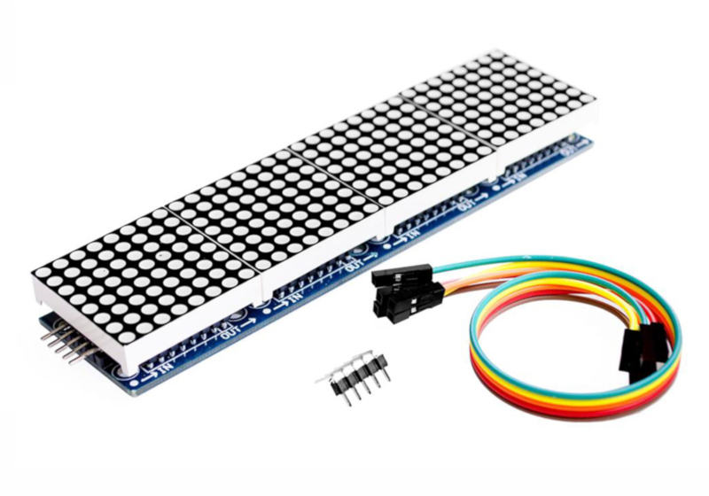

Ausgabe
=======

Jedes datenverarbeitende System - wie ein Mensch oder ein Computer -
gliedert sich in die drei Teile: Eingabe, Verarbeitung und Ausgabe. Eine
Möglichkeit etwas auszugeben haben wir im letzten Kapitel kennen
gelernt. In diesem Kapitel gehen wir etwas genauer auf die Klasse LED
ein und lernen im Anschluss, wie man ein Display und einen Summer an den
ESP32 anschließt.

> **Hinweis**
> Da sich dieses Tutorial noch im Aufbau befindet, findest du hier nur ein
> paar Beispielprogramme. Experimentiere mit den Programmen, um
> herauszufinden, wie du die Befehle einsetzten kannst.

Spaß mit LEDs
-------------

Die Datei `test/led.py` demonstriert die Möglichkeiten der Klassen `LED`
und `RGB_LED`

```python
from lib.display.led import LED, RGB_LED

led_red = LED(15)
led_green = LED(4)
led_blue = LED(16)

led_red.fade_up(10)
led_red.fade_down(10)
led_green.fade_up(10)
led_green.fade_down(10)
led_blue.fade_up(10)
led_blue.fade_down(10)

rgb = RGB_LED(led_red, led_green, led_blue)
rgb.rainbow()

led_red.off()
led_green.off()
led_blue.off()
```

```python
import test.led
```

Das LED-Matrix Display
----------------------



Verbinde **VCC** mit der roten Versorgungsspannung auf den Steckbrett
und **GND** mit der blauen. Verbinde **DIN** mit **GPIO23 (SPI MOSI)**,
**CS** mit **GPIO2** und **CLK** mit **GPIO18 (SPI CLK)**.

```python
from machine import Pin, SPI
from lib.display.max7219 import Matrix8x8
from time import sleep_ms

# Initialisiere den SPI-Bus
sck = Pin(18, Pin.OUT)
mosi = Pin(23, Pin.OUT)
miso = Pin(19, Pin.IN)
cs = Pin(2, Pin.OUT)
spi = SPI(baudrate=100000, polarity=0, phase=0, sck=sck, mosi=mosi, miso=miso)

display = Matrix8x8(spi, cs, 4)
display.brightness(0)

display.fill(1)
display.text('Halo',0,0,0)
display.show()
sleep_ms(2000)

display.fill(0)
display.text('Welt',0,0,1)
display.show()
sleep_ms(2000)

display.fill(0)
display.rect(0,0,32,8,1)
display.show()
```

```python
import test.matrix
```

### Quellen

-   <https://github.com/mcauser/micropython-max7219>

Das OLED-Display
----------------

```python
from machine import I2C, Pin
from lib.display.ssd1306 import SSD1306_I2C
from time import sleep_ms

# Initialisiere den I2C-Bus
bus = I2C(scl=Pin(22), sda=Pin(21))

oled = SSD1306_I2C(128, 64, bus)

oled.fill(0)
oled.text("Hallo Welt", 10, 20)
oled.show()
sleep_ms(2000)

oled.fill(1)
oled.text("Hallo Welt", 10, 20, 0)
oled.show()
```

### Quellen

-   <https://github.com/adafruit/micropython-adafruit-ssd1306>
-   <https://github.com/peterhinch/micropython-samples/tree/master/SSD1306>

Töne Erzeugen mit einem Summer
------------------------------
