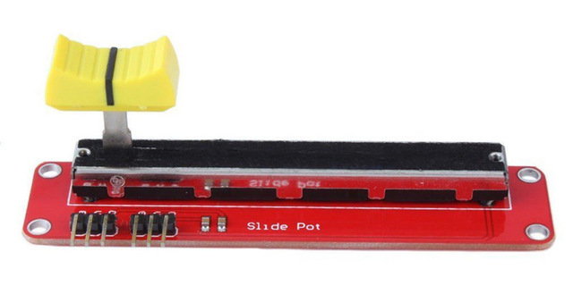

Eingabe Teil 1
==============

> **Hinweis**
> Da sich dieses Tutorial noch im Aufbau befindet, findest du hier nur ein
> paar Beispielprogramme. Experimentiere mit den Programmen, um
> herauszufinden, wie du die Befehle einsetzten kannst.

Analoge Eingabe (ADC)
---------------------

### Regensensor

### Schiebewiderstand

Für dieses Modul benötigst du die beiden 470 Ohm Widerstände (gelb -
lila - braun - gold). Verbinde den **VCC**-Pin über einen 470 Ohm
Widerstand mit Plus (rot), den **GND**-Pin über einen 470 Ohm Widerstand
mit Minus (blau) und den **OTA**-Pin mit **GPIO 36 (VP)**.



```python
from machine import Pin, ADC
from time import sleep_ms
from lib.display.led import LED, RGB_LED

led = LED(2)

adc = ADC(Pin(36))
adc.atten(ADC.ATTN_11DB)
adc.width(ADC.WIDTH_9BIT)
try:
    while True:
        value = adc.read() // 2
        led.brightness(value)
        print(value)
        sleep_ms(50)
except KeyboardInterrupt:
    led.off()
    print("Bye")
```

```python
import test.adc
```

### Fotowiderstand (LDR)

### Touch

Digitale Eingabe
----------------

### Taster

### Bodenfeuchtesensor

### Bewegungssensor

### Inkrementalgeber
