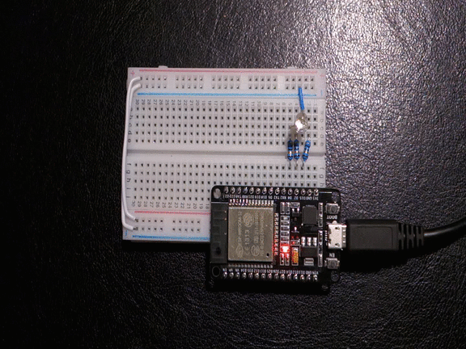
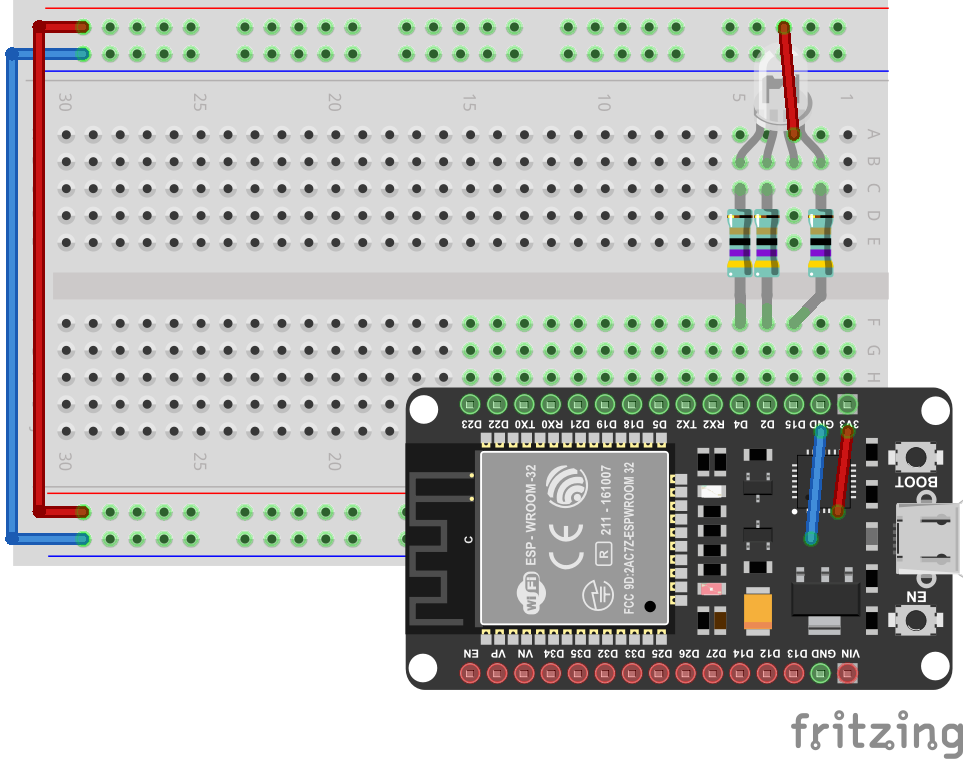
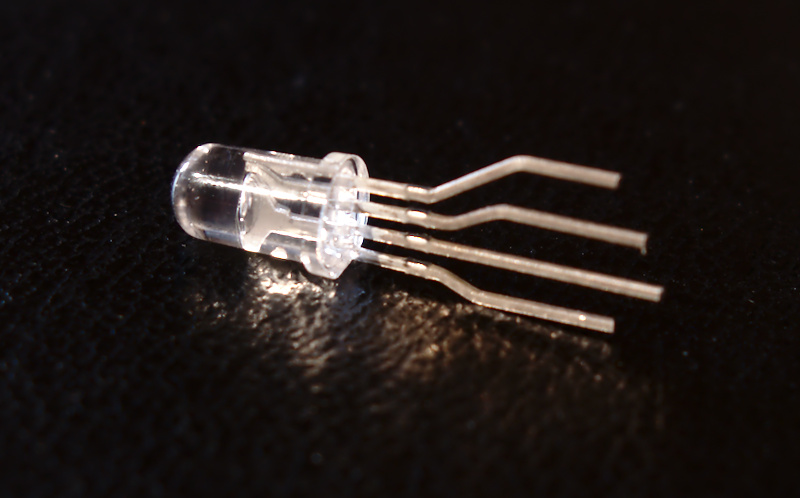
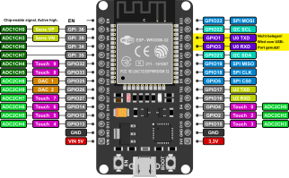

Erste Schritte
**************

Gleich kann es los gehen. Im ersten Kapitel wirst du eine RGB-LED zum blinken bringen. Das tolle an einer RGB-LED ist, dass sie in allen Farben leuchten kann. Jede Farbe kann durch das Mischen der drei Grundfarben Rot, Grün und Blau erzeugt werden.

Aber bevor es los geht, gibt es noch paar Dinge die du wissen solltest.

Das Steckbrett
--------------

Wie du sicher weißt, fließt der Strom immer vom Plus-Pol zum Minus-Pol. Plus heißt, dass das Potential hier bei 3,3 Volt liegt und Minus steht für 0 Volt. Auf deinem Steckbrett stehen die roten Linien für Plus (3,3V) und die beiden blauen Linien für Minus (0V). Die Farbe Schwarz deutet auch manchmal auf den Minus-Anschluss hin.

..  note::
    Wenn du einen Blick auf den ESP32 wirfst, wirst du erkennen, dass zwei Pins mit dem Aufdruck ``GND`` beschriftet sind. ``GND`` steht für *Ground* und das heißt im Grunde nichts anderes als Minus.

Grundaufbau
^^^^^^^^^^^

Baue als erstes die Schaltung genau wie auf dem Bild nach. Achte ganz penibel darauf, dass alle Kabel genau dort sind, wo sie hin gehören. Lass dich von den Farben auf dem Bild nicht irritieren. Du wirst in deinem Steckbrücken-Set selten die gewünschte Farbe in der richtigen Länge finden. Wähle die Steckbrücke einfach nach der Länge aus.

.. image:: img/Grundaufbau_Steckplatine.png

Die beiden Steckbrücken rechts unten verbinden den Plus- und Minus-Pol des ESP32 mit dem Steckbrett. 3,3V wird mit der roten Versorgungsleitung und GND mit der blauen Versorgungsleitung verbunden.

Die beiden Kabel links verbinden den Plus- (rot) und Minus-Pol (blau) der oberen und unteren Hälfte des Steckbretts miteinander.

Wenn du als nächstes das ESP32-Board einsetzt, wirst du mit ein wenig Druck und Feinfühligkeit vorgehen müssen um weder das Board noch das Steckbrett zu beschädigen. Bei manchen Steckbrettern ist das gar nicht so einfach. Wenn du hier nicht vorsichtig bist, kann es passieren, dass du später Probleme bekommst. Handle also unbedingt mit Gefühl!

Auf dem zweiten Bild kannst du sehen, wie du die RGB-LED und die drei Widerstände mit dem ESP32 verbindest.

..  warning::
    Ließ dir unbedingt zu erst den nächsten Abschnitt durch bevor du die RGB-LED falsch herum einsetzt! Die Länge der vier Anschlusspins spielt nämlich eine wichtige Rolle.

Wissenswertes über LEDs
-----------------------

Es zwei wichtige Dinge, die man über LEDs wissen sollte. Normale LEDs haben zwei Anschlüsse. Eine Kathode (Minus) und eine Anode (Plus). RGB-LEDs bestehen im Prinzip aus drei normalen LEDs - eine rote, eine blaue und eine grüne. Müsste eine RGB-LED dann  nicht 6 Anschlüsse, für drei Anoden und drei Kathoden, haben?

Die Antwort ist ganz einfach: Nein, denn innerhalb der RGB-LED werden, je nach Typ, entweder alle drei Anoden (Plus-Pole) oder alle drei Kathoden (Minus-Pole) miteinander verbunden. Bei der RGB-LED im Set handelt es sich um eine vom Typ *common anode* also gemeinsame Anode. Also haben die Plus-Pole der drei LEDs einen gemeinsamen Anschluss. **Man erkennt ihn am langen Pin!** Dieser Anschlusspin sollte also immer mit Plus verbunden sein.

Eine zweite Sache sollte man auch immer im Hinterkopf behalten. LEDs dürfen niemals ohne einen Vorwiderstand in einen Stromkreis eingebaut werden. Die 47Ohm Widerstände sind auf die 3,3V des ESP32 abgestimmt. Jede LED bekommt einen eigenen Widerstand. Am besten kürzt du die Beinchen der Widerstände mit einem Seitenschneider auf die halbe Länge.

Das Pinout-Diagramm
-------------------

Das Schaubild zeigt dir welche Funktion(en) die 30 Pins deines ESP32-Boards haben.
Nimm dir einen Moment Zeit und mache dir klar welche fünf Pins du aktuell in deiner Schaltung benutzt.

Dein erstes Programm
--------------------

Hier ist ein kleines Python-Programm, das die LED dreimal rot blinken lässt. Speichere es unter dem Dateinamen main.py im Verzeichniss ``~\esp32 ab`` (``~`` steht für dein home-Verzeichnis).

..  code-block:: py
    :linenos:
    
    from lib.display.led import LED
    from time import sleep_ms

    led_red = LED(15)
    led_green = LED(2)
    led_blue = LED(4)

    for x in range(3):
        led_red.on()
        sleep_ms(500)
        led_red.off()
        sleep_ms(500)
