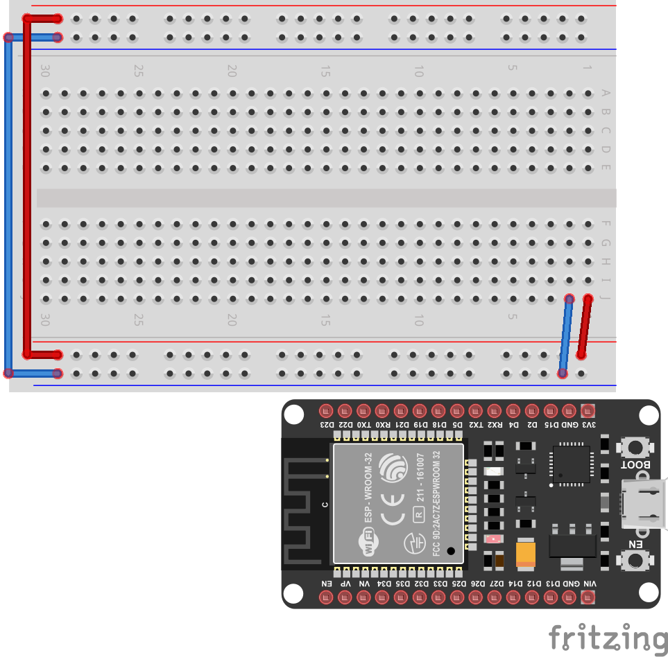
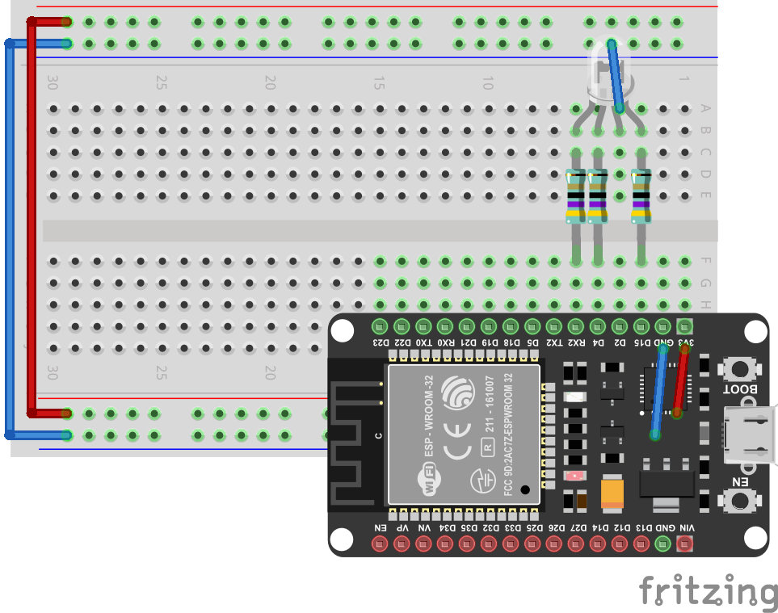

Erste Schritte
**************

Los geht's. In diesem Kapitel wollen wir eine RGB-LED zum leuchten bringen. Das tolle an einer RGB-LED ist, dass sie in allen Farben leuchten kann. Jede Farbe kann durch das Mischen der drei Grundfarben Rot, Grün und Blau erzeugt werden.

.. image:: img/RGB_LED.jpg

Anschlussplan
-------------

Baue als aller erstes die Schaltung auf deinem Steckbrett nach und achte dabei ganz penibel darauf, dass alle Kabel genau dort sind, wo sie laut der Zeichnung hin gehören. Wenn ein einziges Kabel falsch angeschlossen ist, kann es sein, dass nichts mehr funktioniert. Die beiden Leitungen in der rechten oberen Ecke stellen die Stromversorgung zwischen dem Board und dem Steckbrett her und liegen unter dem Board. die weißen Kabel verbinden den Plus- (rot) und Minus-Pol (blau) der oberen und unteren Hälfte des Steckbretts miteinander. Bei den farbigen Teilen handelt es sich um 47Ω Widerstände. Diese schützen die LED vor zu großen Strömen.

Wenn du das ESP32-Board einsetzt, wirst du mit ein wenig Druck und Feinfühligkeit vorgehen müssen um weder das Board noch das Steckbrett zu beschädigen. Bei machen Steckbrettern ist das ein sehr schwieriges Unterfangen. Wenn hier etwas schief geht, kann es passieren, dass du später Probleme bekommst, für die ein Wackelkontakt verantwortlich ist.

Pinbelegung
-----------

Dieses Schaubild zeigt die Belegung der Pins. Das sind die kleinen Stifte, die du eben in das Steckbrett gedrückt hast. Vergleiche mal die weißen Boxen in denen GPIO steht mit der Beschriftung auf dem Board. Zum Beispiel steht neben dem Pin D0 GPIO16. Die LED ist an den Pins D5, D6 und D8 angeschlossen. Übersetzt man die Namen mit dem Schaubild kommt man auf GPIO14, GPIO12 und GPIO15. Findest du diese Zahlen in dem Programm weiter unten wieder?

.. image:: img/ESP32-DOIT_Pinout.png

Beispiel
--------

Hier ist ein kleines Python-Programm, das die LED dreimal rot blinken lässt. Speichere es unter dem Dateinamen main.py im Verzeichniss ~\esp32 ab (~ steht für dein home-Verzeichnis).

.. code-block:: py
   :linenos:
   
   import machine
   import time
   led_rot = machine.Pin(15, machine.Pin.OUT)
   led_blau = machine.Pin(4, machine.Pin.OUT)
   led_gruen = machine.Pin(2, machine.Pin.OUT)

   for x in range (3):
       led_rot.value(1)
       time.sleep(1)
       led_rot.value(0)
       time.sleep(1)

.. image:: img/blink.gif
