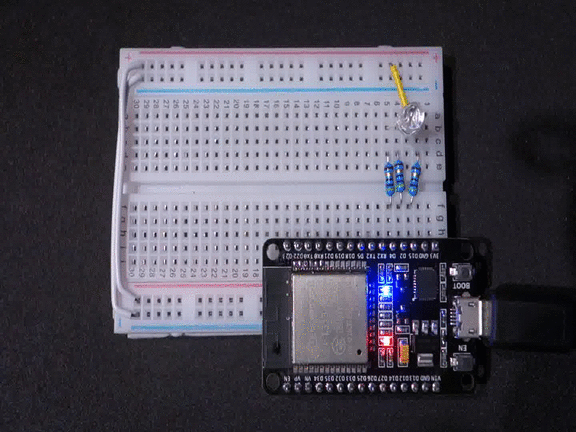
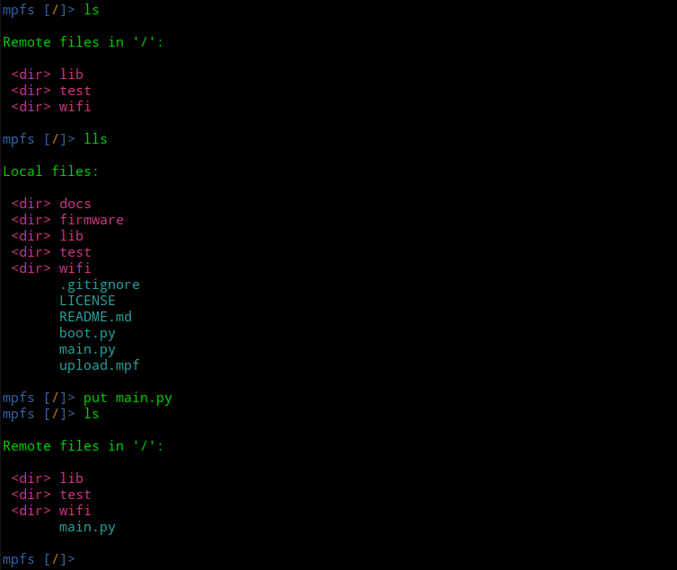

Erste Schritte
**************

Gleich kann es los gehen. Im ersten Kapitel wirst du eine RGB-LED zum blinken bringen. Das tolle an einer RGB-LED ist, dass sie in allen Farben leuchten kann. Jede Farbe kann durch das Mischen der drei Grundfarben Rot, Grün und Blau erzeugt werden.

Aber bevor es los geht, gibt es noch paar Dinge die du wissen solltest.

Das Steckbrett
==============

Wie du sicher weißt, fließt der Strom immer vom Plus-Pol zum Minus-Pol. Plus heißt, dass das Potential hier bei 3,3 Volt liegt und Minus steht für 0 Volt. Auf deinem Steckbrett stehen die roten Linien für Plus (3,3V) und die beiden blauen Linien für Minus (0V). Die Farbe Schwarz deutet auch manchmal auf den Minus-Anschluss hin.

..  note::
    Wenn du einen Blick auf den ESP32 wirfst, wirst du erkennen, dass zwei Pins mit dem Aufdruck ``GND`` beschriftet sind. ``GND`` steht für *Ground* und das heißt im Grunde nichts anderes als Minus.

Grundaufbau
-----------

Baue als erstes die Schaltung genau wie auf dem Bild nach. Achte ganz penibel darauf, dass alle Kabel genau dort sind, wo sie hin gehören. Lass dich von den Farben auf dem Bild nicht irritieren. Du wirst in deinem Steckbrücken-Set selten die gewünschte Farbe in der richtigen Länge finden. Wähle die Steckbrücke einfach nach der Länge aus.

.. image:: img/Grundaufbau_Steckplatine.png

Die beiden Steckbrücken rechts unten verbinden den Plus- und Minus-Pol des ESP32 mit dem Steckbrett. 3,3V wird mit der roten Versorgungsleitung und GND mit der blauen Versorgungsleitung verbunden.

Die beiden Kabel links verbinden den Plus- (rot) und Minus-Pol (blau) der oberen und unteren Hälfte des Steckbretts miteinander.

Wenn du als nächstes das ESP32-Board einsetzt, wirst du mit ein wenig Druck und Feinfühligkeit vorgehen müssen um weder das Board noch das Steckbrett zu beschädigen. Bei manchen Steckbrettern ist das gar nicht so einfach. Wenn du hier nicht vorsichtig bist, kann es passieren, dass du später Probleme bekommst. Handle also unbedingt mit Gefühl!

.. image:: img/Grundaufbau_mit_LED_Steckplatine.png

Auf dem zweiten Bild kannst du sehen, wie du die RGB-LED und die drei Widerstände mit dem ESP32 verbindest.

..  warning::
    Ließ dir unbedingt zu erst den nächsten Abschnitt durch bevor du die RGB-LED falsch herum einsetzt! Die Länge der vier Anschlusspins spielt nämlich eine wichtige Rolle.

Wissenswertes über LEDs
=======================

Es zwei wichtige Dinge, die man über LEDs wissen sollte. Normale LEDs haben zwei Anschlüsse. Eine Kathode (Minus) und eine Anode (Plus). RGB-LEDs bestehen im Prinzip aus drei normalen LEDs - eine rote, eine blaue und eine grüne. Müsste eine RGB-LED dann  nicht 6 Anschlüsse, für drei Anoden und drei Kathoden, haben?

Die Antwort ist ganz einfach: Nein, denn innerhalb der RGB-LED werden die drei Anoden (Pluspole) der drei LEDs miteinander verbunden. Bei der RGB-LED im Set handelt es sich um ein Bauteil vom Typ *common anode* also gemeinsame Anode. Die Pluspole der drei LEDs haben also einen gemeinsamen Anschluss. **Man erkennt ihn am langen Pin!**

**Dieser lange Anschlusspin sollte also immer mit Plus (rot) verbunden sein.**

Es gibt auch RGB-LEDs vom Typ *common cathode* zu kaufen. Sie haben logischerweise einen gemeinsamen Minuspol.

.. image:: img/RGB_LED.jpg

Eine zweite Sache sollte man auch immer im Hinterkopf behalten. LEDs dürfen niemals ohne einen Vorwiderstand in einen Stromkreis eingebaut werden. Die 47Ohm Widerstände sind auf die 3,3V des ESP32 abgestimmt. Jede LED bekommt einen eigenen Widerstand. Am besten kürzt du die Beinchen der Widerstände mit einem Seitenschneider auf die halbe Länge.

Das Pinout-Diagramm
===================

Das Schaubild zeigt dir welche Funktion(en) die 30 Pins deines ESP32-Boards haben.
Nimm dir einen Moment Zeit und mache dir klar welche fünf Pins du aktuell in deiner Schaltung benutzt.

.. image:: img/ESP32-DOIT_Pinout.png

Dein erstes Programm
====================

Hier ist ein kleines Python-Programm, das die LED dreimal rot blinken lässt. Speichere es unter dem Dateinamen main.py im Verzeichniss ``~/esp32 ab`` (``~`` steht für dein home-Verzeichnis).

..  code-block:: py
    :linenos:
    
    from lib.display.led import LED
    from time import sleep_ms

    led_red = LED(15)
    led_green = LED(2)
    led_blue = LED(4)

    for x in range(3):
        led_red.on()
        sleep_ms(500)
        led_red.off()
        sleep_ms(500)

Jetzt muss diese Datei auf das Board kopiert werden. Dazu öffnest du im Verzeichnis ``esp32`` ein Terminal und startest dort das Programm ``mpfshell``. Das Bild zeigt dir, was alles schief gehen kann. Der erste Befehl ``ls`` kann nicht ausgeführt werden, da noch keine Verbindung zum Board hergestellt wurde. Im zweiten Anlauf wurde vergessen das Board an den Computer anzuschließen und dann teilt der Computer im dritten Anlauf dem Board den Namen ``ttyUSB1`` zu. Das passiert aber eher selten. Schlussendlich steht die Verbindung und nachdem Kommando ``repl`` begrüßt dich der typische Python-Promt ``>>>``.

.. image:: img/open_ttyUSB0.png

Um die Datei ``main.py`` kopieren zu können, musst du die REPL (*Read–Eval–Print Loop*) wieder verlassen. Drücke dazu Die Taste ``9 ]`` während du die Tasten ``Strg`` und ``Alt Gr`` gedrückt hältst. Auf einer englischsprachigen Tastatur macht diese Tastenkombination mehr Sinn und ist einfacher zu finden. Aber damit müssen wir uns abfinden.

Im nächsten Bild siehst du, wie du dir den Verzeichnisinhalt des ESP32 und des lokalen Ordners anzeigen lassen kannst. Erkennst du den Unterschied? Versuche zu verstehen, was genau ``ls`` und was ``lls`` macht.

Wie du sicher schon bemerkt hast, hat sich der Ordnerinhalt auf dem ESP32 nach dem **put**-Befehl verändert. Die Datei ist kopiert worden. Um sie auszuführen muss der ESP32 jetzt neu gestartet werden.

Gib erneut ``repl`` ein und drücke ``Strg`` und ``D`` um den ESP32 neu zu starten. Die Datei ``main.py`` wird immer automatisch gestartet wenn der ESP32 neu bootet.

Wenn alles geklappt hat, müsste die LED jetzt blinken.

Gratulation! Du hast soeben einen Mikrochip programmiert!

Aufgabe
=======

* Lass abwechselnd die rote, die blaue und die grüne LED leuchten.
* Ändere die Blinkgeschwindigkeit.
* Lass die LED abwechselnd in den 6 Farben: Rot, Violett, Blau, Cyan, Grün und Gelb leuchten.
