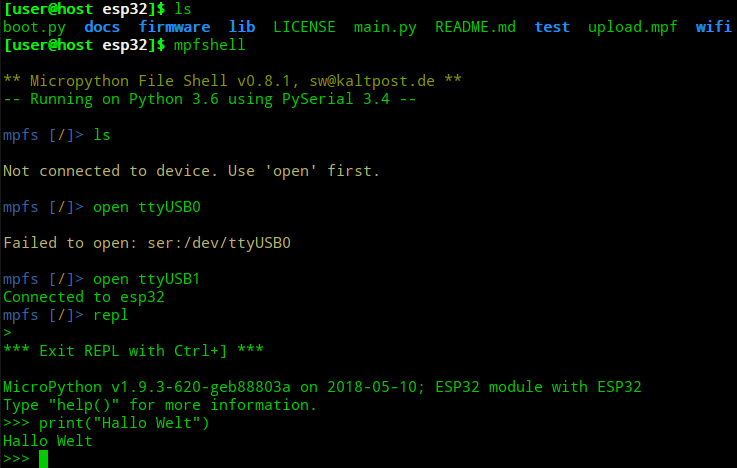
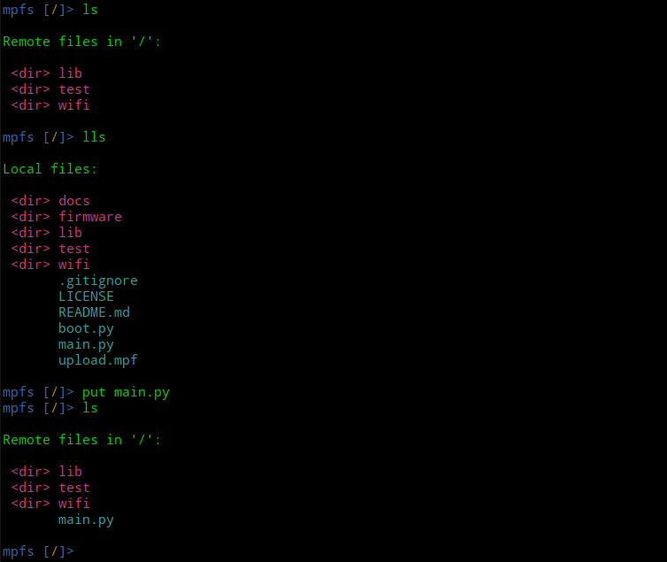

Linux (mpfshell)
================

Speicher das Programm in einer neuen Datei mit dem Dateinamen `main.py`
im Verzeichniss `~/esp32 ab` (`~` steht für dein home-Verzeichnis).

Öffne im Verzeichnis `esp32` ein Terminal und startest dort das Programm
`mpfshell`.

Das Bild zeigt dir, was alles schief gehen kann. Der erste Befehl `ls`
kann nicht ausgeführt werden, da noch keine Verbindung zum Board
hergestellt wurde. Im zweiten Anlauf wurde vergessen das Board an den
Computer anzuschließen und dann teilt der Computer im dritten Anlauf dem
Board den Namen `ttyUSB1` zu. Das passiert aber eher selten.
Schlussendlich steht die Verbindung und nachdem Kommando `repl` begrüßt
dich der typische Python-Promt `>>>`.

Um die Datei `main.py` kopieren zu können, musst du die REPL
(*Read--Eval--Print Loop*) wieder verlassen. Drücke dazu Die Taste `9 ]`
während du die Tasten `Strg` und `Alt Gr` gedrückt hältst. Auf einer
englischsprachigen Tastatur macht diese Tastenkombination mehr Sinn und
ist einfacher zu finden. Aber damit müssen wir uns abfinden.

Im nächsten Bild siehst du, wie du dir den Verzeichnisinhalt des ESP32
und des lokalen Ordners anzeigen lassen kannst. Erkennst du den
Unterschied? Versuche zu verstehen, was genau `ls` und was `lls` macht.

Wie du sicher schon bemerkt hast, hat sich der Ordnerinhalt auf dem
ESP32 nach dem **put**-Befehl verändert. Die Datei ist kopiert worden.
Um sie auszuführen muss der ESP32 jetzt neu gestartet werden.

Gib erneut `repl` ein und drücke `Strg` und `D` um den ESP32 neu zu
starten. Die Datei `main.py` wird immer automatisch gestartet wenn der
ESP32 neu bootet.
