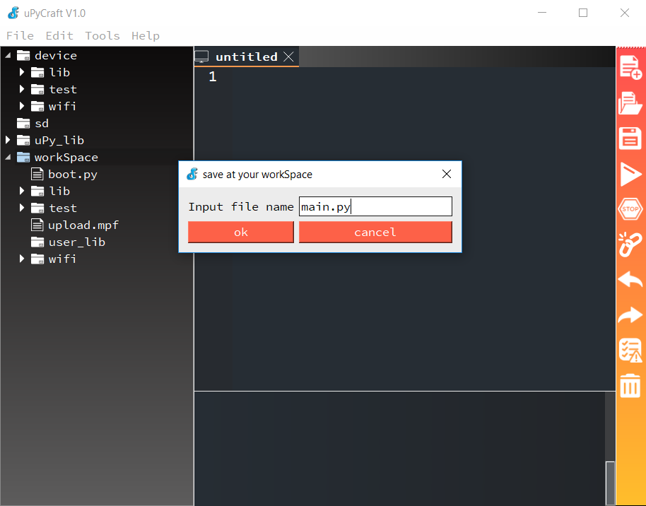
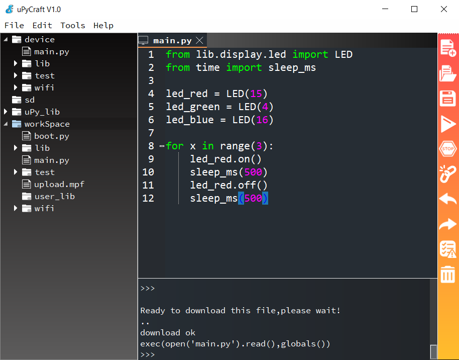

Windows (uPyCraft)
==================

Erstelle zu erst eine neue Datei indem du in der Symbolleiste rechts das
oberste Symbol wählst.

Speichere die Datei anschließend in deinem *WorkSpace* indem du auf das
Diskettensymbol rechts klickst und den Dateinamen `main.py` eingibst.

Im letzten Schritt klickst du auf das *Play*-Symbol (Nr. 4 von oben) um
die Datei in den Speicher des ESP32 zu kopieren und auszuführen.

So einfach geht das. Bedenke, dass du jede Datei, die du bereits auf den
ESP32 kopiert hast auch einfach durch einen Rechtsklick auf die Datei im
Verzeichnisbaum links starten kannst.
