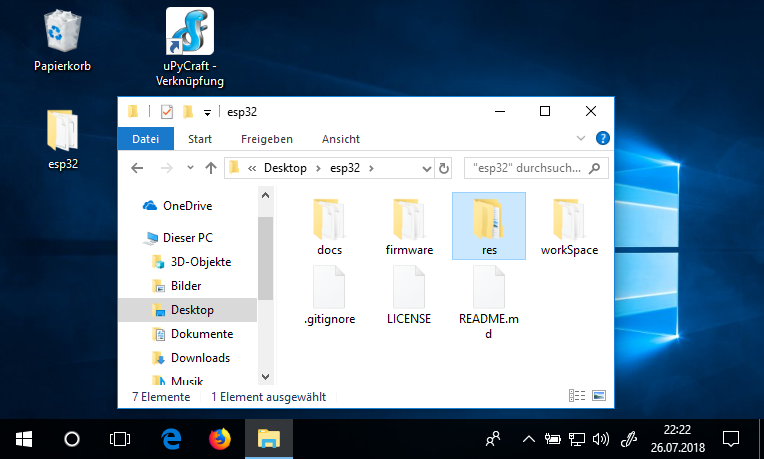
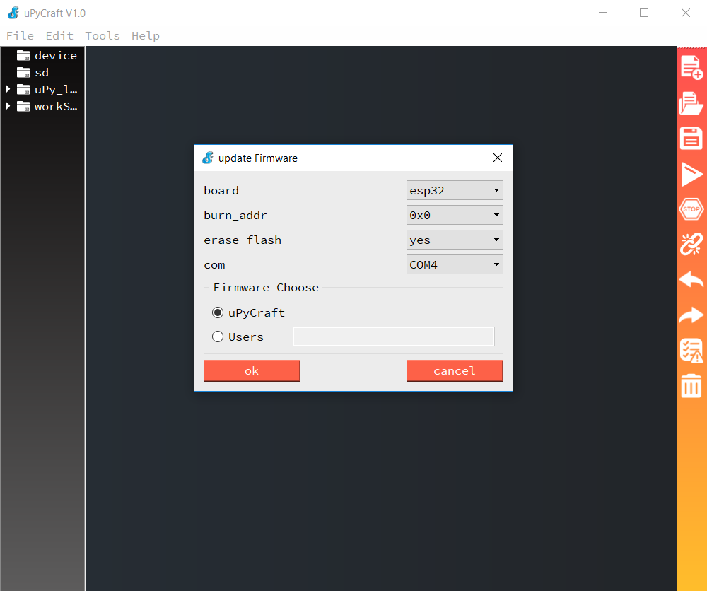
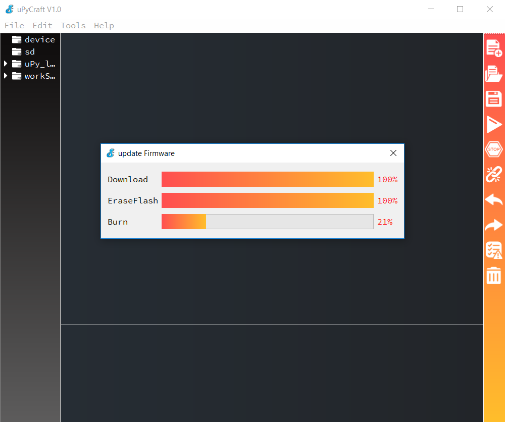
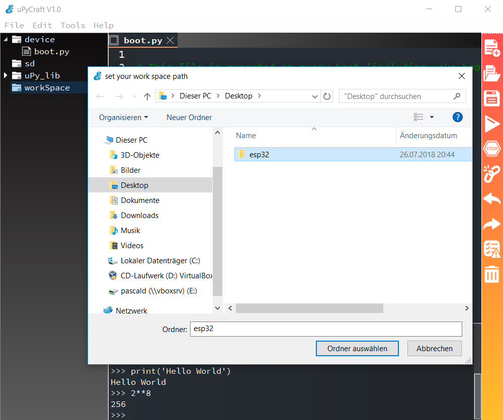
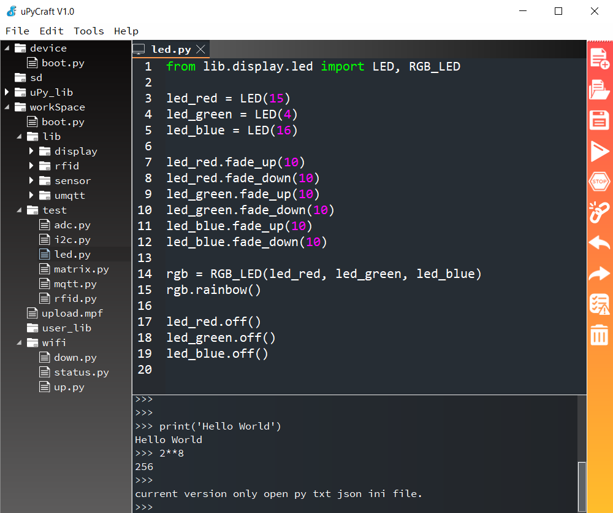
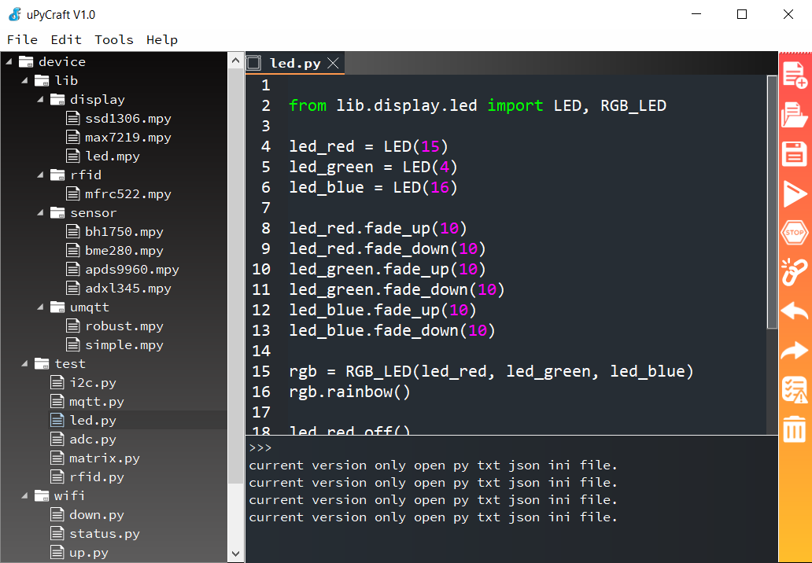

Windows Setup
=============

Um los zu legen, lädst du dir die [zip-Datei mit der App und allen
Treibern](https://github.com/Tasm-Devil/Micropython-Tutorial-for-esp32/archive/master.zip)
herunter und öffnest sie.

Entpacke anschließend den Ordner `Micropython-Tutorial-for-esp32-master`
aus der zip-Datei auf deinen Desktop und benenne ihn in `esp32` um.

Öffne als nächstes den Ordner und gehe in das Verzeichnis
`Desktop > esp32 > res > Software` und erstelle von der Datei
`uPyCraft.exe` eine Verknüpfung auf deinen Desktop.

Schließe das ESP32-Board jetzt an den Computer an und installiere den
Treiber aus der zip-Datei
`Desktop > esp32 > res > Software > CP210x_Universal_Windows_Driver.zip`
indem du zu erst die zip-Datei entpackst und anschließend das Setup
`CP210xVCPInstaller_x64` ausführst.

Wenn du zum ersten mal das **uPyCraft** startest, wirst du gebeten eine
Schriftart zu installieren. Im Anschluss begrüßt dich die App mit einer
grafischen Benutzeroberfläche. Klicke jetzt in der Menüleiste auf
**Tools -\> Serial** und wähle einen COM-Port aus. Das Dialogfenster
*update Firmware* öffnet sich so wie in der nächsten Abbildung.

Achte darauf, dass du das richtige board (esp32) auswählst und lasse
uPyCraft die Firmware selbst auswählen und aus dem Internet laden indem
du auf **ok** klickst. Zunächst wird die neuste Micropython-Firmware
heruntergeladen und im Anschluss wird der Speicher des ESP32 mit der
neuen Firmware überschrieben. Die kleine blaue LED zeigt diesen Vorgang
durch ein flackern an.

Wenn alles geklappt hat, sollte im unteren Bereich ein Python-Promt
`>>>` auftauchen.

Jetzt wählst du noch den Ordner `esp32` als Arbeitsverzeichnis aus indem
du links im Verzeichnisbaum auf **workSpace** klickst.

::: {.note}
::: {.admonition-title}
Note
:::

Achtung! wähle **nicht** den Ordner `Desktop > esp32 > workSpace`
sondern `Desktop > esp32`. Um eine falsche Wahl rückgängig zu machen,
klicke in der Menüleiste auf `Tools > InitConfig`
:::

Im nächsten Bild siehst du, wie eine Datei aus dem Arbeitsverzeichnis
geöffnet wurde. Auch im Python-Terminal (REPL) wurden schon ein paar
Befehle ausprobiert.

Manchmal musst du in der Menüleiste auf **File \> Reflush Directory**
klicken, um den Verzeichnisbaum links zu aktualisieren.

Zu guter Letzt musst du noch die drei Verzeichnisse `lib`, `test` und
`wifi` auf den ESP32 kopieren. Leider geht das nicht in einem Zug. Jeder
Ordner muss von Hand angelegt und jede Datei muss einzeln kopiert
werden.

::: {.warning}
::: {.admonition-title}
Warning
:::

Achtung! Alle `py`-Dateien müssen kopiert werden. Einzige Ausnahme sind
die `py`-Dateien im Verzeichnis `lib`. Diese Dateien **nicht** kopieren.
Statt dessen müssen die `mpy`-Dateien kopiert werden. Das sind die
Treiber für die verschiedenen Module.
:::

Überprüfe ob alles passt, indem du deinen Verzeichnisbaum mit dem
nächsten Bild vergleichst.

