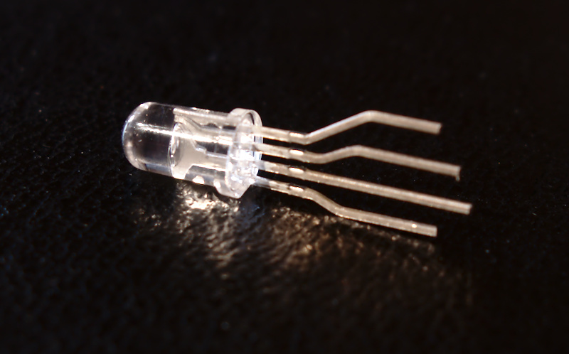
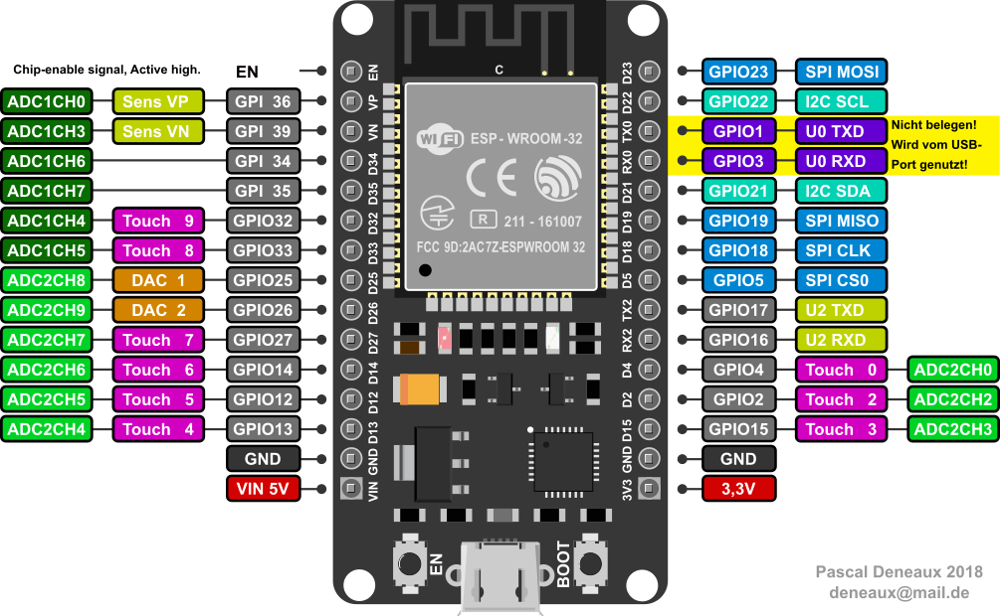

Vorbereitungen
==============

In diesem Kapitel bekommst Schritt für Schritt gezeigt, was du tun
musst, um deinen Computer fürs Programmieren vorzubereiten.

Wenn du Linux benutzt, musst du zunächst ein paar Programme installieren
um dann in einem Terminal die Treiber auf den ESP32 zu kopieren. Das
Windows Setup ist vergleichsweise einfach. Unter Windows nutzt du die
grafische App **uPyCraft** - unter Linux arbeitest du mit der
Konsolenanwendung **mpfshell**.

Wähle hier, je nachdem welches Betriebssystem du nutzt, ein Setup aus
und befolge die Anleitung.

Software installieren
---------------------

::: {.toctree}
Setup\_Windows Setup\_Linux
:::

Wenn alles geklappt hast, bist du von der Software-Seite her jetzt
bereit um los zu legen. Nimm dir aber noch die Zeit um auch schon die
Hardware vorzubereiten. Du darfst jetzt auch alle Tütchen auspacken und
den Lötkolben einschalten.

Hardware Vorbereiten
--------------------

Im Sortiment befinden sich 5 Taster und zwei RGB-LEDs. Die Beinchen der
Leuchtdioden sind viel zu lang und viel zu nah beieinander. Versuche mit
etwas Geschick die Beinchen so wie auf dem Bild zu biegen. Im Anschluss
kannst du die Beinchen mit einem Seitenschneider auf die halbe Länge
kürzen. Jetzt passt die LED super in das Steckbrett.

::: {.warning}
::: {.admonition-title}
Warning
:::

Achte unbedingt darauf, dass die Länge der Beinchen vor und nach dem
Kürzen das gleiche Verhältnis zueinander haben. Das längste Beinchen
sollte also auch nach dem Kürzen länger als die anderen sein.
:::

Die vier Beinchen der Taster musst du mit der Pinzette um 90° verdrehen
damit sie in das Steckbrett passen. Schau dir am besten die beiden Fotos
an. Dann weißt du was du machen musst. Alle Taster sollen so wie der
rechts im Bild aussehen.

Schau dir auf dem nächsten Bild die Beinchen an. Sie sind genau um 90°
verdreht.

Fertig? Noch nicht ganz. Einige Sensoren werden mit Stiftleisten
geliefert. Diese Stifte müssen noch an die Platine gelötet werden. Lass
dir helfen wenn du noch nie gelötet hast.

Pinout-Diagramm ausdrucken
--------------------------

Last but not least solltest du dir das Pinout-Diagramm ausdrucken.
Klicke dazu mit der rechten Maustaste auf das Bild und wähle
anschließend *Bild anzeigen* im Kontextmenü deines Browsers aus. Danach
öffnet sich ein neuer Tab in deinem Browser. Drucke das Bild aus indem
du auf deiner Tastatur die Tasten **Strg** und **P** gemeinsam drückst.

