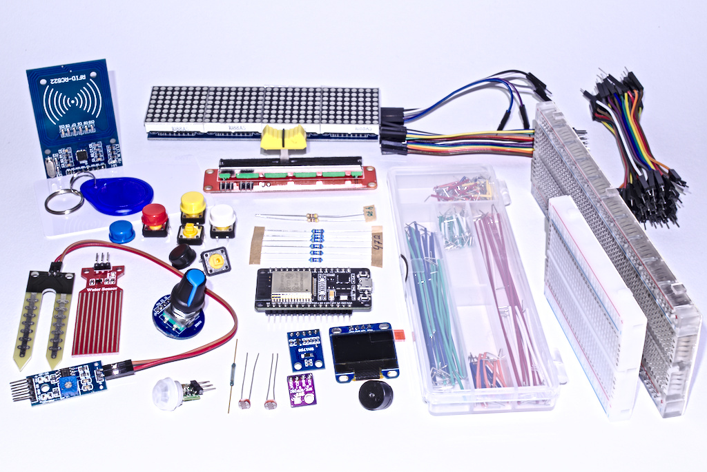

Ein Micropython Tutorial für den esp32-Mikrocontroller
######################################################

.. toctree::
   :maxdepth: 3
   :caption: Inhaltsverzeichnis:

   Vorbereitungen
   ErsteSchritte
   Ausgabe
   Eingabe1
   Eingabe2
   Internet
   Kaufberatung
   Lizenz

Vorwort
=======

.. warning::
    Diese Dokumentation befindet sich im Aufbau.

Bevor es los geht...

An wen richtet sich diese Dokumentation ?
-----------------------------------------

Entstehung

Im Netz finden sich fast keine deutschsprachigen Anleitungen zu Micropython. Nachdem  ich mich intensiv mit dem esp8266 und dem Nachfolger esp32 auseinandergesetzt habe, viele Blogs und englischsprachige Tutorials gelesen und die Vor- und Nachteile gegenüber dem erprobten Arduino abgewägt habe, bin ich zu der Entscheidung gelangt, dass endlich ein deutschsprachiges Tutorial für den Schulunterricht oder das Selbststudium her muss.

Aufbau dieses Tutorials.

Voraussetzungen
---------------

#. Hardware (IOT Box)
#. Software (Firmware, Treiber, Bibliotheken, Tools)
#. Dieses Tutorial und die Referenz
